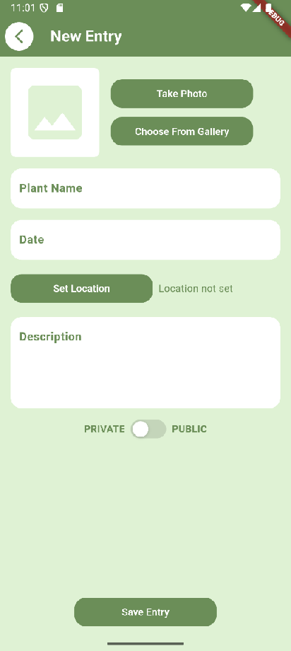

# PlantSpotter

Mobile app for journaling and sharing plant adventures.

This Flutter App is used to share plants that you can find in nature. The user fills his own Journal with entries of plants (image of plant, plant name, date, location, description, option to make entry public), but can also see others' entries on a community page. For every entry there is an option to see it's location and navigate to it. There is also an option to learn more about the plant by getting information from Wikipedia.

## Technologies used

Technologies used for this project:

- Frontend: Flutter, Dart
- State Management: Provider
- Navigation: go_router
- Database: Firebase Cloud Firestore, Firebase Storage
- Authentication: Firebase Authentication
- Location Services: geolocator, flutter_map, OpenStreetMap, GoogleMaps
- Image and Camera Services: image_picker, camera
- Web Services: Wikipedia API
- Other packages: http, url_launcher, path, shared_preferences, cupertino_icons

## Page Structure

The app has the following page structure:
1. Login Page (Log in with e-mail and password)
2. Register Page (Register with e-mail and password)
3. Home Page (Choose to go the Journal Page or the Community Page)
4. My Journal Page (See your journal filled with entry cards of plant adventures)
5. Community Page (See the entries from the community)
6. New Entry Page (Create a new Entry)
7. Set Location Page (Set the location for your entry)
8. Details Page (See more information about a selected entry)
9. See Location Page (See the location of a selected entry)
10. Learn More Page (Learn more from Wikipedia about a plant from a selected entry)

## Functionalities

### Authentication

Authentication is enabled with Firebase Authentication using an e-mail address and password. The user can register through the Register Page or log into an existing account through the Login Page. In case of an error, a message appears accordingly.
The user can also successfuly log out.

### Fetching Entries

All entries are kept in a database collection named 'entries' (Firebase Cloud Firestore) and fetched when needed. For the My Journal Page all entries by the currently logged in user are displayed, while all others (public entries) are displayed on the Community Page. On these pages the entries are displayed as cards with an image of the plant, the plant's name, the date and the creator of the entry.

### Creating New Entry

A form is displayed on the New Entry Page, that contains all necessary fields:

- Image
- Plant Name
- Date
- Location
- Description
- Private/Public switch

For the image, the user has the option to take a photo using camera or choose an existing image from gallery.

For the location, the user navigates to the Set Location Page, where by default a pin is placed on a map on the user's current location. The user can move the pin or choose the default placement.

After all fields are correctly filled, the user can save the new entry. The entry is then added to the 'entries' collection in the database.

### Details for Entry and Privacy Switch

On the Details Page, a detailed view of a selected entry is displayed (image, plant name, date, description, creator). If the logged in user is the creator of the entry, an option to change the privacy status of the entry is given, using a private/public switch.

### Location of Entry and Navigation

On the Details Page, there is an option to see the location of the entry, which navigates to the See Location Page. A pin is placed on a map, showing the location. The user can click the pin in order to redirect to Google Maps to get the fastest route to the location.

### Fetching more information from Wikipedia

On the Details Page, there is also an option to learn more about the plant from the entry, by navigating to the Learn More Page, where information fetched from Wikipedia is displayed (image and summary).

## Images of the App

| Register Page                                                             | Login Page                                                          |
| ------------------------------------------------------------------------- | ------------------------------------------------------------------- |
|  |  |

| Home Page                                                         | My Journal Page                                                              | Community Page                                                              |
| ----------------------------------------------------------------- | ---------------------------------------------------------------------------- | --------------------------------------------------------------------------- |
|  |  |  |

| Details Page                                                            | See Location Page                                                                | Learn More Page                                                         |
| ----------------------------------------------------------------------- | -------------------------------------------------------------------------------- | ---------------------------------------------------------------------------- |
|  |  |  |

| New Entry Page                                                             | Set Location Page                                                                |
| -------------------------------------------------------------------------- | -------------------------------------------------------------------------------- |
|  |  |

## Figma Prototype

Link to prototype: https://www.figma.com/proto/FlP5oQla0uHTQbezrL8Lhh/PlantSpotter?node-id=0-1&t=we8Asp72KwwxrFH3-1
